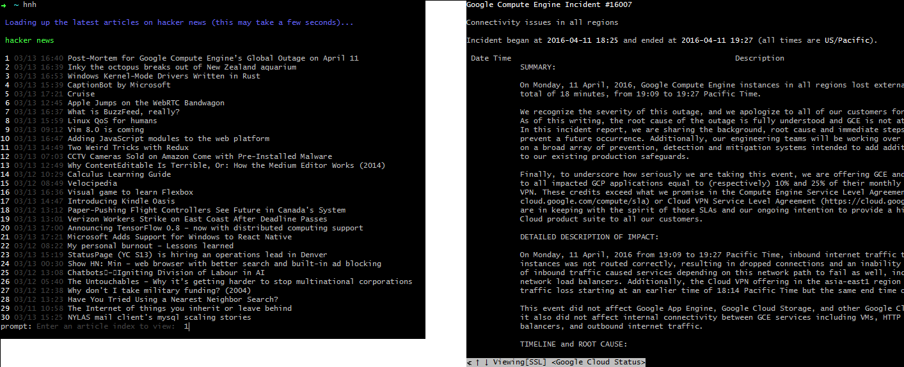

[](https://badge.fury.io/js/hn-headless)

#hacker news headless
Browse the latest [hacker news](https://news.ycombinator.com) articles without
ever leaving your terminal.

[](https://raw.githubusercontent.com/rcorrie/hn-headless/master/demo.png)

## install
```sh
$ npm install -g hn-headless
```

*note:* you must have [w3m](http://w3m.sourceforge.net/) installed.
```sh
$ sudo apt-get install w3m
```
```sh
$ brew install w3m
```

## usage
```sh
$ hnh
```

## license
ISC © [ricardo corrie](http://rcorrie.com)
